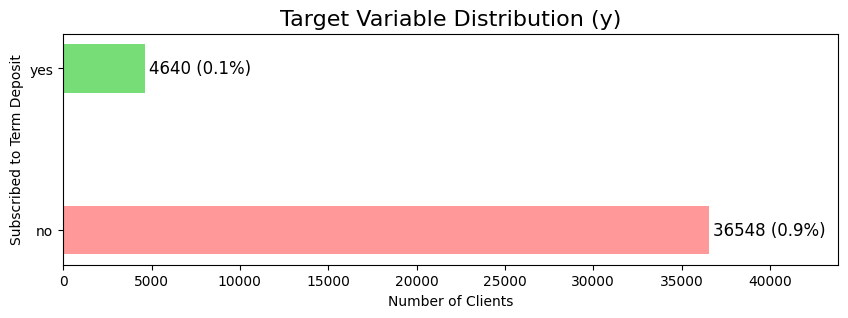
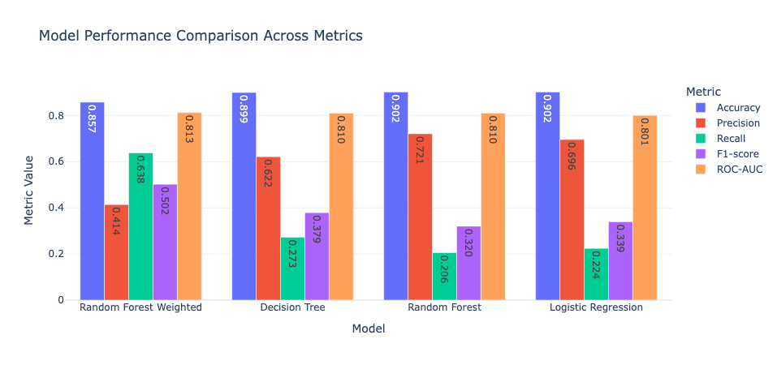
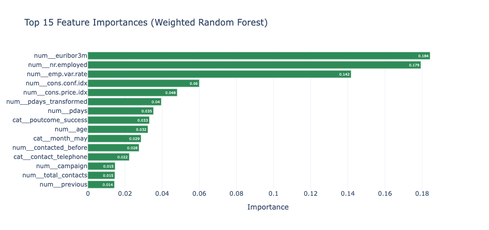
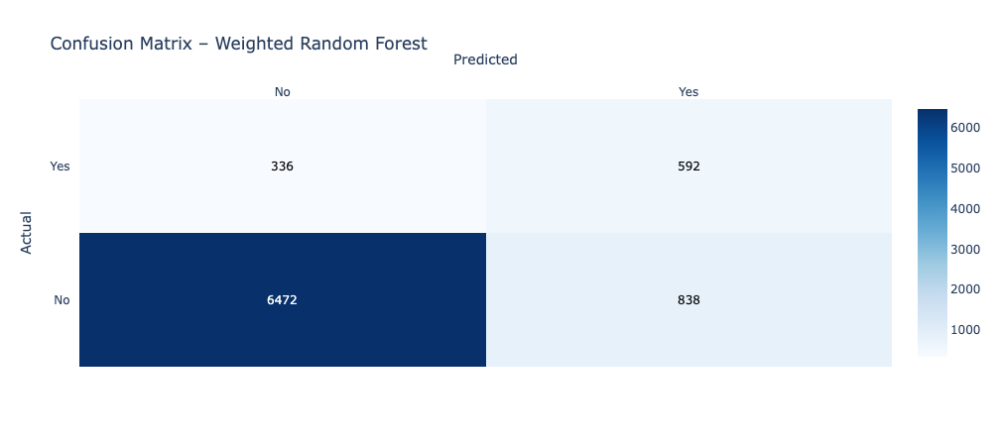

# 📊 Customer Subscription Prediction for Bank Term Deposits

Predicting which bank customers are most likely to subscribe to a term
deposit using machine learning --- with a focus on business impact,
class imbalance handling, and deployable model design.

---

## 📌 Project Overview

Direct marketing campaigns in banking are expensive and can negatively
impact customer experience when poorly targeted.

The goal of this project is to:

- Identify clients most likely to subscribe to a term deposit\
- Build a robust predictive model for ranking customers\
- Optimize marketing efforts by focusing on high-probability leads

---

## 📂 Dataset

- **Source:** UCI Machine Learning Repository\
- **Observations:** 41,188 client contacts\
- **Target Variable:** `y` (Subscribed: Yes/No)\
- **Features:** 20

Feature groups include:

- Client attributes (age, job, education, etc.)
- Campaign data (contact month, previous outcome, etc.)
- Economic indicators (euribor3m, employment rate, etc.)

---

## ⚠️ Key Challenge: Class Imbalance

- 88.7% did not subscribe\
- 11.3% subscribed

Accuracy alone would be misleading. A naïve model predicting "No" would
achieve \~89% accuracy while being useless in practice.

Therefore, evaluation prioritized:

- ROC-AUC
- Recall
- Precision
- F1-score

---

## 🔍 Data Preparation & Feature Engineering

### Leakage Prevention

The feature `duration` (call length) was excluded because it is only
known after a call is completed. Including it would create data leakage
and unrealistic performance.

### Feature Engineering

- Converted `pdays = 999` to `-1` (never contacted)
- Created `contacted_before` binary flag
- Created `total_contacts` (campaign + previous)
- Treated `"unknown"` values as meaningful categories

### Preprocessing

- `ColumnTransformer`
- `scikit-learn Pipeline`
- Stratified train-test split
- 5-fold cross-validation

---

## 🤖 Models Evaluated

1.  Logistic Regression\
2.  Decision Tree\
3.  Random Forest\
4.  Weighted Random Forest

### 🏆 Final Model: Weighted Random Forest

- **ROC-AUC:** 0.81\
- **Recall:** 0.64\
- **Precision:** 0.41\
- **F1-score:** 0.50

Chosen due to strongest recall and overall discrimination power.

---

## 📊 Visualizations

### Class Imbalance



### Model Comparison



### Feature Importance



### Confusion Matrix



All visualizations are located in the `/visualization` folder.

---

## 🎯 Business Interpretation

- Identifies \~64% of actual subscribers\
- Acceptable trade-off between recall and precision\
- Supports ranking customers for targeted campaigns\
- Reduces wasted marketing resources

---

## 🛠️ Tech Stack

- Python
- pandas
- NumPy
- scikit-learn
- matplotlib

---

## 📁 Project Structure

    Customer-Subscription-Prediction-for-Bank-Term-Deposits/
    │
    ├── notebooks/
    ├── visualization/
    ├── data/
    ├── requirements.txt
    └── README.md

The project follows a structured machine learning workflow: - Data
exploration and cleaning - Feature engineering - Model training and
evaluation - Business interpretation of results

---

## 🚀 How to Run the Project

### 1️⃣ Clone the Repository

```bash
git clone https://github.com/beingbiplov/Customer-Subscription-Prediction-for-Bank-Term-Deposits.git
cd Customer-Subscription-Prediction-for-Bank-Term-Deposits
```

### 2️⃣ (Optional) Create a Virtual Environment

```bash
python -m venv venv
```

Activate it:

**macOS / Linux**

```bash
source venv/bin/activate
```

**Windows**

```bash
venv\Scripts\activate
```

---

### 3️⃣ Install Dependencies

```bash
pip install -r requirements.txt
```

---

### 4️⃣ Launch Jupyter Notebook

```bash
jupyter notebook
```

Open the main notebook file and run all cells sequentially to reproduce
the analysis and results.

---

## 📌 Notes

- The project is notebook-based and designed for reproducible
  experimentation.
- All evaluation metrics and visualizations are generated within the
  notebooks.
- Visual outputs are also stored in the `/visualization` folder for
  reference.

## 💡 Key Takeaways

- Proper handling of class imbalance is critical
- Leakage prevention ensures deployable ML
- Business alignment matters more than raw accuracy
- Economic indicators strongly influence subscription behavior

---
